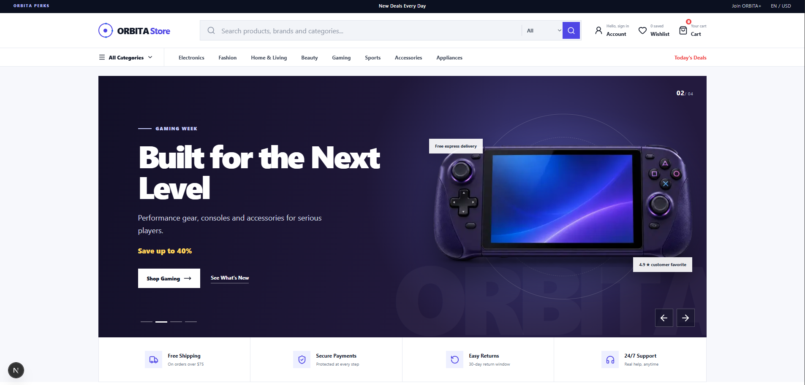
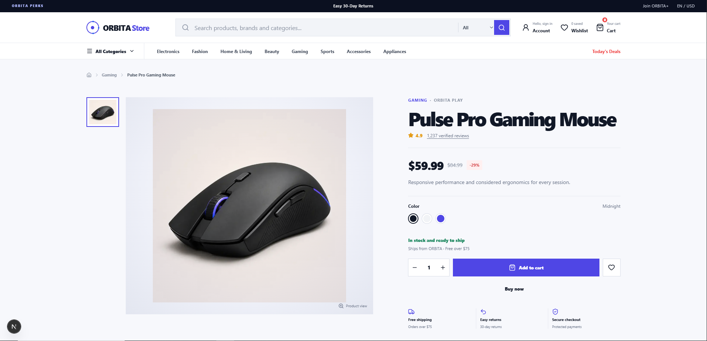
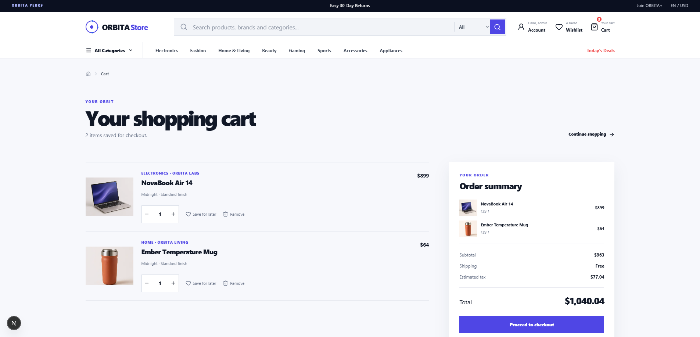
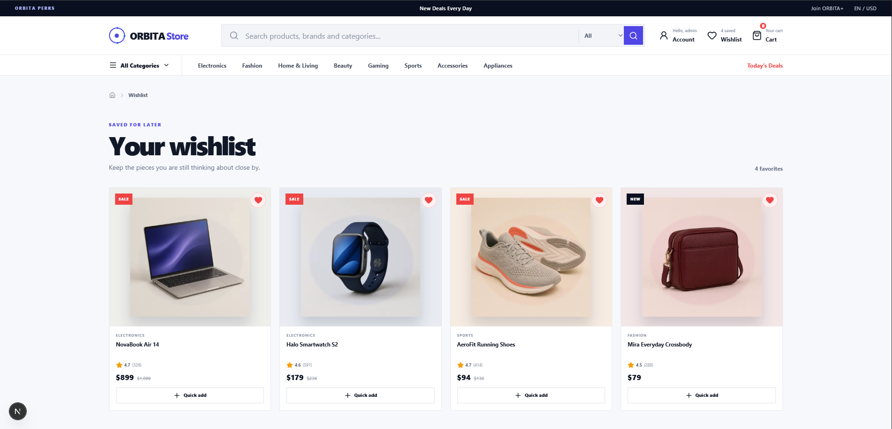
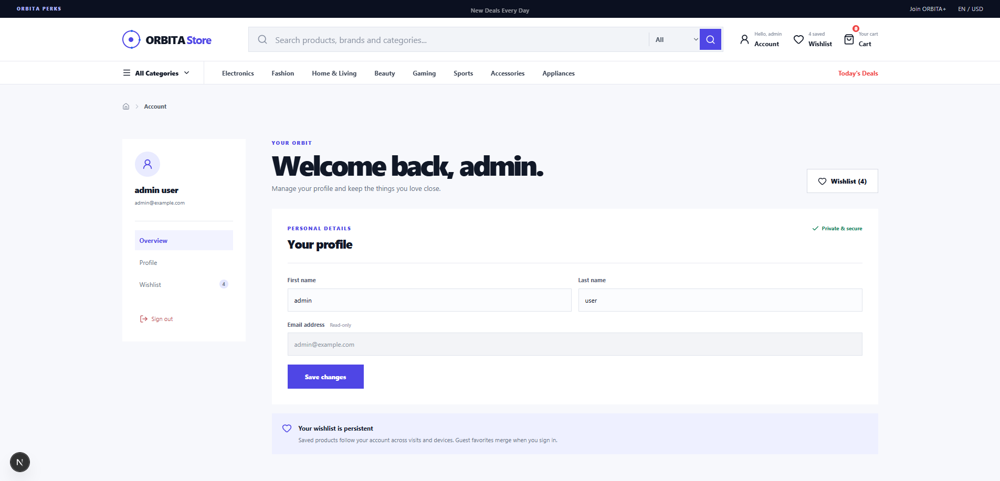

# ORBITA Store

A modern full-stack e-commerce demo built with Next.js, TypeScript, PostgreSQL and Prisma.

## Screenshots

### Home

<p align="center">
  
</p>

### Products

<p align="center">
  
</p>

### Cart

<p align="center">
  
</p>

### Wishlist

<p align="center">
  
</p>

### Profile

<p align="center">
  
</p>

## Features

* Modern responsive e-commerce interface
* Product browsing and product details
* Product search and filtering
* Shopping cart
* Wishlist
* User registration and login
* User account and profile
* PostgreSQL-backed wishlist persistence
* Prisma ORM
* Demo checkout flow
* Responsive design
* Smooth animations and interactions

## Tech Stack

* Next.js
* React
* TypeScript
* Node.js
* PostgreSQL
* Prisma
* Tailwind CSS
* GSAP
* Framer Motion

## How to Run

### 1. Clone the repository

```bash
git clone https://github.com/oussamah213/ORBITA-store.git
cd ORBITA-store
```

### 2. Install dependencies

```bash
npm install
```

### 3. Configure environment variables

Copy the example environment file:

```bash
cp .env.example .env
```

For Windows PowerShell:

```powershell
Copy-Item .env.example .env
```

Open `.env` and configure:

```env
DATABASE_URL="your_postgresql_connection_string"
AUTH_SECRET="your_long_random_secret"
```

### 4. Set up PostgreSQL and Prisma

Make sure PostgreSQL is running and the database configured in `DATABASE_URL` exists.

Generate the Prisma client:

```bash
npm run prisma:generate
```

Apply the database migration:

```bash
npm run prisma:migrate
```

### 5. Start the development server

```bash
npm run dev
```

Open the application in your browser:

`http://localhost:3000`

## Production Build

Create a production build:

```bash
npm run build
```

Start the production server:

```bash
npm start
```

## Environment Variables

The project requires the following environment variables:

```env
DATABASE_URL=
AUTH_SECRET=
```

Never commit your real `.env` file or production credentials to GitHub.

Use `.env.example` as the public template.

## Project Status

ORBITA Store is a portfolio and learning project.

The application includes a functional frontend, user authentication, account management and PostgreSQL-backed wishlist persistence.

Products and some commerce functionality use demo data.

Payment processing is simulated and no real payment transaction is performed.

## License

This project is currently provided for portfolio and educational purposes.
